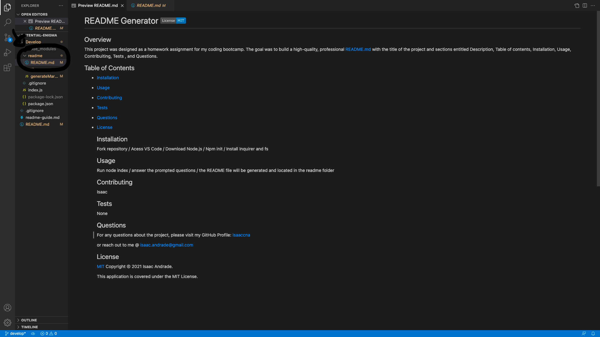

# Professional README Generator Starter Code
# README Generator 

  ## Overview
  This project was designed as a homework assignment for my coding bootcamp. The goal was to build a high-quality, professional README.md with the title of the project and sections entitled Description, Table of contents, Installation, Usage, Contribuiting, Tests , and Questions.

  [How to create a Professional README](./readme-guide.md)

  ## Table of Contents
   - [Installation](#installation)
   - [Usage](#usage)
   - [Contributing](#contributing)
   - [Tests](#tests)
   - [Questions](#questions)
   - [License](#license)

  ## Installation
   - Fork repository 
   - Access VS Code 
   - Download Node.js 
   - Npm init 
   - Install Inquirer and FS

  ## Usage
   - Run "node index"
   - Answer the prompted questions 
   - The README file will be generated and located in the "readme" folder.

   [Walkthrough video](https://watch.screencastify.com/v/g4sXFBrM92OnflTEiFml)

   

  ## Contributing
   Isaaccna

  ## Tests
   None

  ## Questions
   For any questions about the project, please visit my:  
   GitHub Profile: [isaaccna](https://github.com/isaaccna)  
   or  
   Email: @ isaac.andrade1231@gmail.com

  ## License
  [MIT](https://opensource.org/licenses/MIT)
  Copyright © 2021 Isaac Andrade. 

  This application is covered under the MIT License.

